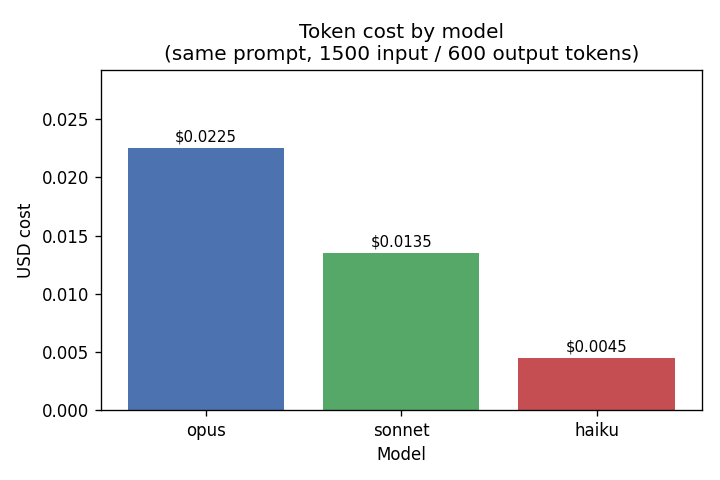
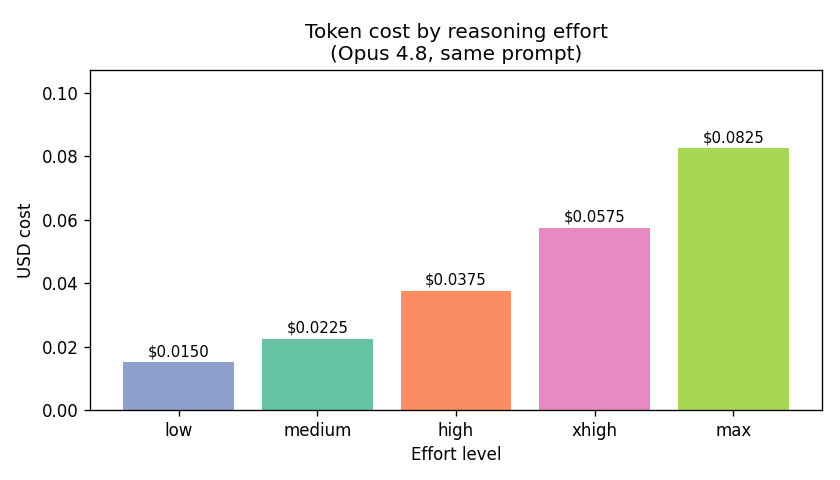
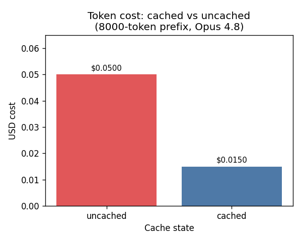

## The day in one line

> **CSV → analysed → shipped → automated**

We start with `data/orders.csv` (Adriatica's sales data).
By the end, a report writes itself every Monday morning — and you never touch a line of code.

::: notes
Keep this slide up while you do housekeeping. Remind participants: their job today is to direct the agent in plain English, not to write code.
:::

---

# Block 1 — Doorway & Setup {background-color="#2c3e50"}

## What is Claude Code?

- An AI agent that lives in your terminal
- You talk to it in plain English — it reads files, writes code, runs scripts
- You are the director; Claude is the doer
- The terminal is **a conversation**, not a command line

::: notes
Stress: no programming knowledge needed. The terminal looks scary but today it is just a chat window.
:::

## The terminal as a conversation

| Old mental model | Today's mental model |
|---|---|
| Type exact commands | Type what you want |
| Memorise syntax | Describe the goal |
| Debug code yourself | Ask Claude to fix it |
| One command, one result | One prompt, many steps |

::: notes
The table reframes what participants already fear. Give them 30 seconds to read it silently.
:::

## ▶ Your turn — B1

Open your terminal, then type these one at a time:

```
claude --version
```

```
claude
```

Once Claude is running, paste:

```
What files are in this folder, and what do they look like they're for?
```

::: notes
Walk the room. The two most common issues: "command not found" (Node/npm path) and "log in" prompt (browser sign-in). Both are fast fixes.
:::

---

# Block 2 — The Loop & The Goal {background-color="#1a5276"}

## How the agent loop works

1. **Gather context** — Claude reads the files you point it to
2. **Act** — it writes code, runs it, checks the output
3. **Verify** — it compares the result to your goal
4. **Repeat** — if something is off, it tries again

You approve each action before it runs.
Nothing happens behind your back.

::: notes
Draw the loop on the whiteboard if possible. Emphasise: Claude is not magic — it is a loop that shows you every step.
:::

## Plan mode & approvals

- **Default mode**: Claude asks before every file write or command
- **Plan mode** (`Shift+Tab` twice): Claude reads everything and proposes a plan — makes **no changes** until you say go
  - `Shift+Tab` cycles: default → acceptEdits → plan
- **acceptEdits**: auto-approves file edits (useful for experienced users)

Best practice for today: stay in **default mode** and read each approval prompt before clicking Yes.

::: notes
Demo the Shift+Tab cycle visually if possible. Remind participants: plan mode is their "safe preview" option whenever they are unsure.
:::

## ▶ Your turn — B2 (goal prompt)

Start Claude if it is not running: `claude`

Paste this into the chat:

```
Here is a sales file: data/orders.csv. I want a monthly sales
report — total revenue per month, and which month was best.
Plan your approach first, then do it.
```

When Claude pauses and asks whether to continue, type:

```
Yes, go ahead.
```

::: notes
Circulate. Make sure participants read the plan Claude proposes before approving. The plan step is pedagogically important.
:::

## ▶ Your turn — B2 (verify the result)

Once Claude shows you the numbers, ask:

```
What was the best month, and what was its revenue?
```

**Expected answer: the best month is 2024-12 (December).**

If you see a different answer, paste:

```
That doesn't match — December should be the best month.
Re-check how you computed revenue (quantity times unit_price).
```

::: notes
The verification step is the most important habit to build. Running without checking is how bad numbers get into reports.
:::

---

# Block 3a — Turning the Dials {background-color="#154360"}

## Reasoning effort

Claude can think harder — at a cost.

| `/effort` level | What it means |
|---|---|
| `low` | Quick, direct answer |
| `medium` | Balanced — good for everyday tasks |
| `high` | More careful reasoning |
| `xhigh` | Deep analysis — Claude Code's default on Opus 4.8 |
| `max` | Maximum thinking — slowest, most expensive |

Set it: `/effort low` or `/effort high` (or just `/effort` for a picker)

::: notes
Analogy: effort is like asking a consultant to give you a quick gut-feel vs a full written report. Same consultant, different depth.
:::

## Models — pick your price point

| Pick | Model ID | Context | In $/M | Out $/M |
|---|---|---|---|---|
| `opus` | claude-opus-4-8 | 1M | $5 | $25 |
| `sonnet` | claude-sonnet-4-6 | 1M | $3 | $15 |
| `haiku` | claude-haiku-4-5 | 200K | $1 | $5 |

Switch with `/model opus`, `/model sonnet`, `/model haiku`

`/fast` — same Opus quality, up to 2.5× faster, slightly higher cost (Opus only)

::: notes
Haiku is fine for summaries and quick lookups. Opus earns its price on complex multi-step reasoning. Start cheap, upgrade only when the answer quality disappoints you.
:::

## ▶ Your turn — B3a (effort & model)

**Low effort — fast answer:**

```
/effort low
Give me the monthly revenue total and best month from data/orders.csv.
```

**High effort — more considered:**

```
/effort high
Same question — monthly revenue and best month from data/orders.csv. Think it through carefully.
```

**Switch model:**

```
/model sonnet
Summarise the monthly sales results in one sentence.
```

---

# Block 3b — Reading the Meter {background-color="#0b3d6e"}

## What does it actually cost?

*(Illustrative sample numbers — your session will differ)*

{width=75%}

::: notes
Point out: haiku is ~5× cheaper than opus for the same prompt. For simple tasks, haiku is the right default.
:::

## Effort vs cost

*(Illustrative sample numbers)*

{width=75%}

::: notes
Key insight: low effort is not always bad. For routine lookups it is perfectly accurate and much cheaper.
:::

## Caching saves money on repeated context

*(Illustrative sample numbers)*

{width=75%}

If you send the same large document repeatedly, Claude can cache it.
Cache reads cost ~10% of a normal read.

::: notes
Caching is automatic when Claude Code reuses context. Participants don't need to configure it manually — just good to know why costs drop on repeated runs.
:::

## ▶ Your turn — B3b (read the meter)

Check what you have spent this session:

```
/usage
```

See what is filling Claude's memory:

```
/context
```

If context is crowded, free space without losing your work:

```
/compact
```

**Note:** always use `/usage`, not `/cost` — `/cost` is a different plugin command, not the built-in meter.

::: notes
Give participants a minute to run /usage and read the output. The "tokens used / cost so far" line is the key number to find.
:::

---

# Block 4 — Giving Claude Hands {background-color="#1b5e20"}

## What is MCP?

**Model Context Protocol** = new senses and hands for the agent.

- By default Claude can read files and run commands in your terminal
- MCP lets you plug in extra tools: filesystem access, GitHub, databases, web browsers, …
- Each MCP server is a small program that Claude can call via a standard interface
- You add them once; Claude decides when to use them

::: notes
Analogy: Claude is a very capable consultant. MCP is like giving that consultant a company laptop, a GitHub login, and a database password — it can now do more, but with the same careful approval workflow.
:::

## ▶ Your turn — B4 Part A (add the MCP server)

Outside the Claude chat (new terminal tab or press `Ctrl+C` first):

```
claude mcp add filesystem -- npx -y @modelcontextprotocol/server-filesystem .
```

Confirm it was added:

```
claude mcp list
```

Start Claude again and check MCP is active inside the chat:

```
/mcp
```

::: notes
The filesystem server gives Claude access to files on your machine using the MCP protocol — a step beyond the default shell access.
:::

## ▶ Your turn — B4 Part B (GitHub)

Ask Claude to create a repository and push the report script:

```
Create a new GitHub repository called adriatica-sales-report
and push our report script to it.
```

Once Claude confirms the repo exists, open a pull request:

```
Open a pull request that adds a short README
describing the monthly report.
```

**A non-coder just opened a real pull request without typing a single git command.**

::: notes
If GitHub is unavailable on the network, switch to the fallback at fallbacks/b4-pr-example.md — it shows what a successful run looks like so participants can follow along.
:::

## GitHub MCP (the agent-driven path)

For richer, AI-driven GitHub work (not just today's simple push), add the GitHub MCP server:

```
claude mcp add --transport http github \
  https://api.githubcopilot.com/mcp/ \
  --header "Authorization: Bearer <your-GitHub-PAT>"
```

Create a fine-grained PAT at:
`https://github.com/settings/personal-access-tokens`

::: notes
Today we use the simpler gh CLI path. The GitHub MCP server is the next level — useful when participants want Claude to search issues, review PRs, or manage projects autonomously.
:::

---

# Block 5 — A Second Cockpit: Antigravity {background-color="#4a235a"}

## What is Antigravity?

- Google's free agentic IDE — browser-based, no install
- Same agent-loop concept as Claude Code, but with a visual interface
- MCP config transfers: the tools you set up in Block 4 work here too
- Free tier — but runs on a **weekly quota**: budget for scarcity and have the fallback ready

::: notes
Caveat clearly: if a participant hits the quota, they watch the facilitator demo or the fallback recording. They have not lost their work — the quota resets weekly.
:::

## ▶ Your turn — B5 (connect & add a chart)

1. Open [antigravity.google](https://antigravity.google) and sign in with your Google account
2. Click **Open project** → navigate to this project folder
3. In Antigravity's settings → **MCP servers**, paste the config from `fallbacks/b5-antigravity-mcp-config.json`
4. Once the MCP server shows as connected, paste:

```
Open data/orders.csv and add a bar chart of monthly revenue to the report.
```

5. Approve each action the agent proposes

**Verify:** December (2024-12) should be the tallest bar.

::: notes
Walk participants through the MCP settings panel — it is the one unfamiliar UI element. The config JSON is in the fallbacks folder.
:::

---

# Block 6 — Make It Run Itself + Wrap {background-color="#3e2723"}

## Two ways to automate

| | `/loop` | `/schedule` |
|---|---|---|
| Where it runs | Your terminal session | Anthropic cloud |
| Survives closing laptop? | No | Yes |
| Min interval | Any (s/m/h/d) | 1 hour |
| Expires | 7 days | Until cancelled |
| Stop it | Press `Esc` | Cancel in `/schedule` |

::: notes
Loop is the quick demo option. Schedule is what a professional would actually set up for a weekly report.
:::

## ▶ Your turn — B6 Part A (schedule the report)

Ask Claude to set up the schedule:

```
Set up the monthly report to run on a schedule, every Monday
morning, and tell me how it will run.
```

Try the session loop yourself:

```
/loop 1h Generate the monthly sales report from data/orders.csv
and summarise the best month.
```

*(Press `Esc` to stop the loop.)*

For a schedule that persists after you close the terminal:

```
Set this up as a persistent weekly schedule using /schedule.
```

::: notes
The /loop command is session-scoped — it stops if participants close the terminal. /schedule creates a cloud Routine that keeps running. Both are real features; help participants pick the right one for their use case.
:::

## ▶ Your turn — B6 Part B (wrap up)

Ask Claude to reflect on the whole session:

```
Summarise what we built today and what I should always
double-check before trusting your output.
```

Then verify one more time: **is December still the best month?**

**Running ≠ correct.** Always confirm the key numbers before sharing.

::: notes
This is the most important closing message. The agent is fast and confident — but confidence is not accuracy. The December verification is the habit to take home.
:::

## The verify-everything refrain

Before sharing any agent output with a colleague or client:

1. Does the **best month** match what you expect? (2024-12 = December)
2. Is **revenue computed correctly**? (quantity × unit_price, not just one column)
3. Did Claude read the **right file**? (check the file path in the approval prompt)
4. Does the **total look plausible**? (sanity-check the magnitude)

::: notes
Write these four checks on the whiteboard and leave them up for the rest of the day. Participants should be able to recall them without slides.
:::

## What you built today

```
data/orders.csv
    │
    ▼  (Block 2)
monthly sales report
    │
    ▼  (Block 3)
same report, tuned for cost & speed
    │
    ▼  (Block 4)
pushed to GitHub, pull request opened
    │
    ▼  (Block 5)
chart added via Antigravity
    │
    ▼  (Block 6)
runs every Monday, automatically
```

::: notes
Let participants take a photo of this slide. It is their "what did we do today" anchor.
:::

## Where to go next

- **Claude Code docs**: [docs.claude.com](https://docs.claude.com/)
- **MCP servers directory**: [modelcontextprotocol.io](https://modelcontextprotocol.io)
- **More models**: try `/model opus` with `ultrathink` in your prompt for deep reasoning
- **CLAUDE.md**: add a project description file so Claude always has context
- **Try it on your own data**: the same workflow works on any CSV, database, or API

::: notes
CLAUDE.md is the power-user tip: a file in the project root that tells Claude what the project is, what conventions to follow, and what to never do. Participants who add one next week will save significant prompt overhead.
:::
